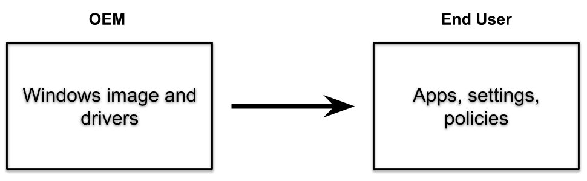

# Windows Autopilot Preparation and Rollout with Manually Registered Device IDs

## Introduction

Windows Autopilot is a collection of technologies designed to set up and pre-configure new devices, getting them ready for productive use. With Windows Autopilot, IT departments can simplify the deployment process for new Windows devices, reducing the time and effort required to get devices into the hands of end users. This tutorial will guide you through the process of preparing and rolling out Windows Autopilot using manually registered device IDs, including the White Glove (pre-provisioning) mode.



## Prerequisites

Before beginning the Windows Autopilot deployment process, ensure you have the following:

- Microsoft Intune subscription
- Microsoft Entra ID (formerly Azure AD) tenant
- Administrative access to Microsoft Intune and Microsoft Entra ID
- Windows 10/11 devices to be enrolled
- PowerShell 5.0 or later
- Get-WindowsAutoPilotInfo script

## Understanding Windows Autopilot Deployment Scenarios

Windows Autopilot supports several deployment scenarios:

1. **User-driven mode** - The standard deployment scenario where the end user unboxes and powers on the device, then signs in with their credentials to complete the setup.

2. **Self-deploying mode** - Designed for kiosk, digital signage, or shared devices that need to be provisioned without user interaction.

3. **Pre-provisioning mode (White Glove)** - Allows IT staff, partners, or OEMs to pre-provision a device before delivering it to the end user, reducing the time the user has to wait during setup.

4. **Autopilot Reset** - Allows IT administrators to reset devices while maintaining the Autopilot enrollment and management.

This tutorial will focus on user-driven mode with manually registered device IDs and pre-provisioning (White Glove) mode.

## Step 1: Create a Security Group in Microsoft Entra ID

First, you need to create a security group in Microsoft Entra ID that will be used to assign Autopilot profiles to devices:

1. Sign in to the [Microsoft Entra admin center](https://entra.microsoft.com) with your administrator account.

2. In the navigation pane, expand **Identity**.

3. Under **Groups**, select **All groups**.

4. In the **Groups | All groups** blade, select **New group**.

5. In the **New Group** blade, configure the following settings:
   - **Group type**: Security
   - **Group name**: IT Devices (or another descriptive name)
   - **Group description**: IT Department Devices (or another description)
   - **Membership type**: Dynamic Device

6. Select **Add dynamic query**.

7. On the **Dynamic membership rules** blade, select **Edit** above the **Rule syntax** box.

8. In the Edit rule syntax text box, add the following membership rule and select **OK**:
   ```
   (device.devicePhysicalIDs -any (_ -contains "[ZTDId]"))
   ```

9. Select **Save** to close **Dynamic membership rules**, and then select **Create** to create the group.

This dynamic group will automatically include all devices registered for Windows Autopilot.

## Step 2: Generate a Device-Specific CSV File

To register devices with Windows Autopilot, you need to collect their hardware IDs. This can be done using the Get-WindowsAutoPilotInfo PowerShell script:

1. Open Windows PowerShell as an administrator on the device you want to register.

2. Install the Get-WindowsAutoPilotInfo script by running:
   ```powershell
   Install-Script -Name Get-WindowsAutoPilotInfo
   ```

3. If prompted to install the NuGet provider or trust the repository, type **Y** and press **Enter**.

4. Set the execution policy to allow the script to run:
   ```powershell
   Set-ExecutionPolicy -ExecutionPolicy RemoteSigned
   ```

5. Generate the CSV file containing the device's hardware ID:
   ```powershell
   Get-WindowsAutoPilotInfo.ps1 -OutputFile C:\Computer.csv
   ```

6. Verify the content of the CSV file:
   ```powershell
   type C:\Computer.csv
   ```

The CSV file contains the device's hardware hash, which is required to register the device with Windows Autopilot.

## Step 3: Import Devices into Windows Autopilot

Now that you have the CSV file with the device's hardware ID, you can import it into Windows Autopilot:

1. Sign in to the [Microsoft Intune admin center](https://intune.microsoft.com) with your administrator account.

2. Select **Devices** from the navigation menu.

3. In the **Device onboarding** section, select **Enrollment**.

4. In the **Windows** tab, scroll down to **Windows Autopilot**, and then select **Devices**.

5. In the **Windows Autopilot devices** blade, select **Import**, select the **folder icon**, browse to the location of your CSV file, select the file, and then select **Open**.

6. Select **Import** to start the import process.

   > Note: The import process can take up to 15 minutes to complete. If the device doesn't appear automatically, select the **Refresh** button. If it still doesn't appear, select the **Sync** button, wait a few minutes, and then select **Refresh**.

## Step 4: Create a Windows Autopilot Deployment Profile

After importing the devices, you need to create a deployment profile that defines the out-of-box experience (OOBE) for the devices:

1. In the Microsoft Intune admin center, select **Devices**.

2. In the **Device onboarding** section, select **Enrollment**.

3. On the Windows enrollment blade, in the details pane, select **Deployment Profiles** under **Windows Autopilot**.

4. Select **Create profile** and then select **Windows PC**.

5. In the **Basics** tab, enter a name for the profile (e.g., "Contoso profile1").

6. For **Convert all targeted devices to Autopilot**, select **No**, and then select **Next**.

7. On the **Out-of-box experience (OOBE)** tab, configure the following settings:
   - **Deployment mode**: User-Driven
   - **Join to Entra ID as**: Microsoft Entra joined
   - **Microsoft Software License Terms**: Hide
   - **Privacy settings**: Hide
   - **Hide change account options**: Hide
   - **User account type**: Administrator
   - **Allow pre-provisioned deployment**: Yes (if you plan to use White Glove mode)
   - **Language (Region)**: Operating system default
   - **Automatically configure keyboard**: Yes
   - **Apply device name template**: No (or Yes if you want to use a naming convention)

8. Select **Next**.

9. On the **Assignments** tab, under **Included groups**, select **Add groups**.

10. Select the security group you created earlier (e.g., "IT Devices") and click **Select**. Select **Next**.

11. On the **Review + create** tab, review the information and then select **Create**.

## Step 5: Configure the Enrollment Status Page (ESP)

The Enrollment Status Page (ESP) shows the status of the device setup process to the user. To configure the ESP:

1. In the Microsoft Intune admin center, select **Devices**.

2. In the **Device onboarding** section, select **Enrollment**.

3. In the **Windows** tab, select **Enrollment Status Page**.

4. Select **Default** to edit the default policy or select **Create profile** to create a new one.

5. Configure the following settings:
   - **Show app and profile installation progress**: Yes
   - **Block device use until all apps and profiles are installed**: Yes (recommended for security)
   - **Allow users to reset device if installation error occurs**: Yes
   - **Allow users to use device if installation error occurs**: No (for better security)
   - **Block device use until these required apps are installed if they're assigned to the user/device**: Select any critical apps

6. Select **Save** if editing the default policy or **Next** and then **Create** if creating a new policy.

## Step 6: Using White Glove (Pre-provisioning) Mode

White Glove, now known as Windows Autopilot for pre-provisioned deployment, allows IT staff, partners, or OEMs to pre-provision a device before delivering it to the end user. This reduces the time the user has to wait during setup.

### Prerequisites for White Glove

- Windows 10 version 1903 or later
- Devices must support TPM 2.0 and device attestation
- Autopilot profile with "Allow pre-provisioned deployment" set to "Yes"
- Enrollment Status Page (ESP) profile assigned to the device

### White Glove Provisioning Process

The White Glove process consists of two phases:

1. **Technician Flow** (Pre-provisioning):
   - Boot the device.
   - At the first OOBE screen, press the Windows key five times.
   - Select **Windows Autopilot provisioning**.
   - Select **Continue**.
   - The device connects to the network and downloads the Autopilot profile.
   - The device applies all device-targeted policies, certificates, and apps.
   - Once complete, the device shuts down automatically.

2. **User Flow**:
   - The end user receives the pre-provisioned device.
   - The user powers on the device and signs in with their credentials.
   - The device applies user-specific policies and installs user-targeted apps.
   - The user is taken directly to the desktop once the process completes.

### Starting the White Glove Process

1. Boot the device and connect it to a network with internet access.

2. At the first OOBE screen (language selection, locale selection, or sign-in page), press the Windows key five times.

3. In the options dialog that appears, select **Windows Autopilot provisioning**.

4. On the Windows Autopilot Configuration screen, select **Continue**.

5. The device will connect to Microsoft Intune, download the Autopilot profile, and begin the provisioning process.

6. Monitor the Enrollment Status Page for progress. This process may take some time depending on the number and size of apps and policies being applied.

7. Once the provisioning is complete, the device will shut down automatically.

8. The device is now ready to be delivered to the end user.

## Step 7: Verifying Autopilot Deployment

After the device has been deployed to the end user, you can verify the deployment status:

1. In the Microsoft Intune admin center, select **Devices** and then **All devices**.

2. Locate the deployed device in the list and select it.

3. Review the device details, including:
   - **Join Type**: Should show "Microsoft Entra joined"
   - **Owner**: Should show the assigned user
   - **Enrollment Type**: Should show "Windows Autopilot"

4. Select **Manage** to see additional management options, including:
   - Retire
   - Wipe
   - Sync
   - Restart
   - Fresh Start
   - Autopilot Reset
   - Quick scan
   - Full scan

## Troubleshooting

If you encounter issues during the Autopilot deployment process, consider the following troubleshooting steps:

1. **Device not appearing in Autopilot devices list**:
   - Verify that the CSV file was generated correctly.
   - Try using the Sync button in the Autopilot devices page.
   - Check if the device has a valid TPM 2.0 module.

2. **Profile not applying during OOBE**:
   - Verify that the profile is assigned to the correct group.
   - Check if the device is a member of the assigned group.
   - Try syncing the device in Intune.

3. **White Glove provisioning fails**:
   - Ensure the device meets the hardware requirements (TPM 2.0).
   - Verify that "Allow pre-provisioned deployment" is set to "Yes" in the Autopilot profile.
   - Check network connectivity to Microsoft Intune and Microsoft Entra ID.

## Conclusion

Windows Autopilot with manually registered device IDs provides a flexible way to deploy Windows devices in your organization. By using White Glove (pre-provisioning) mode, you can further streamline the deployment process, reducing the time end users have to wait during setup.

This tutorial has guided you through the process of preparing and rolling out Windows Autopilot, from creating security groups and generating device-specific CSV files to configuring deployment profiles and using White Glove mode. By following these steps, you can efficiently deploy Windows devices in your organization with minimal IT intervention.

## Additional Resources

- [Windows Autopilot documentation](https://learn.microsoft.com/en-us/autopilot/)
- [Windows Autopilot for pre-provisioned deployment](https://learn.microsoft.com/en-us/autopilot/pre-provision)
- [Microsoft Intune documentation](https://learn.microsoft.com/en-us/mem/intune/)
