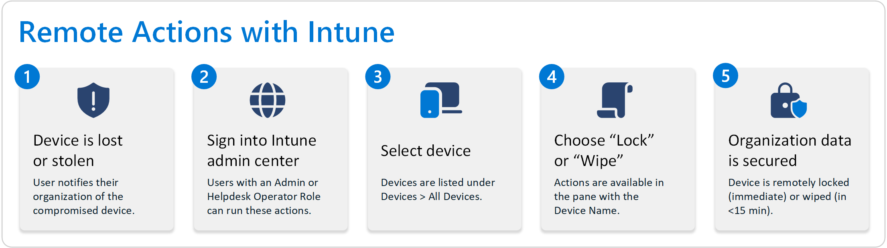
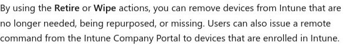
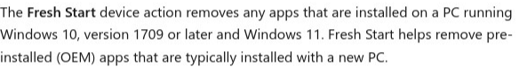

# Intune Device Management Functions: Autopilot Reset, Wipe, and Mobile Device Management

## Introduction

Microsoft Intune provides a comprehensive set of device management functions that allow IT administrators to remotely manage, secure, and troubleshoot devices across their organization. These functions include powerful capabilities such as Autopilot Reset, device wiping, and specific management actions for iOS and Android devices. This tutorial will guide you through these essential device management functions in Intune, helping you understand when and how to use them effectively.

## Prerequisites

Before using the device management functions in Intune, ensure you have:

- Microsoft Intune subscription
- Administrative access to the Microsoft Intune admin center
- Devices enrolled in Intune
- Appropriate administrative permissions (at minimum, the Help Desk Operator role)

## Understanding Remote Actions in Intune

Remote actions in Intune allow administrators to perform various management tasks on enrolled devices without physically accessing them. These actions can be initiated from the Microsoft Intune admin center and are executed when the device next connects to Intune.

Common remote actions include:

- **Wipe**: Factory resets a device, removing all data and settings
- **Retire**: Removes company data while preserving personal data
- **Autopilot Reset**: Refreshes Windows devices while maintaining enrollment
- **Fresh Start**: Removes pre-installed OEM apps while keeping user data
- **Remote Lock**: Locks a device remotely
- **Reset Passcode**: Resets the device passcode
- **Restart**: Remotely restarts a device

## Accessing Remote Actions in Intune

To access remote actions in Intune:

1. Sign in to the [Microsoft Intune admin center](https://intune.microsoft.com).
2. Select **Devices** > **All devices**.
3. Select a specific device from the list.
4. The available remote actions will be displayed at the top of the device page.

## Windows Autopilot Reset

Autopilot Reset is a powerful feature that allows you to reset Windows 10/11 devices while maintaining their Autopilot enrollment status. This is particularly useful for quickly refreshing devices that need to be repurposed or are experiencing issues.

### When to Use Autopilot Reset

- When repurposing a device for a new user
- When troubleshooting persistent software issues
- When refreshing a device's configuration without re-enrolling it
- When preparing a device for redeployment within the organization

### How to Perform an Autopilot Reset

1. Sign in to the [Microsoft Intune admin center](https://intune.microsoft.com).
2. Select **Devices** > **All devices**.
3. Select the Windows device you want to reset.
4. In the menu bar, select the ellipsis (**...**) and then select **Autopilot Reset**.
5. At the confirmation prompt, select **Yes**.

The device will reset to its factory settings while maintaining its Autopilot enrollment status. The next time the device is powered on, it will go through the Autopilot provisioning process again.

## Fresh Start for Windows Devices

Fresh Start is a feature that removes pre-installed (OEM) applications from Windows devices while preserving user data and settings. This is useful for removing bloatware and improving device performance.

### When to Use Fresh Start

- When removing unwanted pre-installed applications
- When improving device performance
- When preparing a device for standardized configuration
- When troubleshooting issues related to pre-installed software

### How to Perform a Fresh Start

1. Sign in to the [Microsoft Intune admin center](https://intune.microsoft.com).
2. Select **Devices** > **All devices**.
3. Select the Windows device you want to refresh.
4. Select **Fresh Start**.
5. Choose whether to **Retain user data on this device**:
   - Keep the device Microsoft Entra joined
   - Device is enrolled into mobile device management again when a Microsoft Entra ID enabled user signs into the device
   - Keep the contents of the device user's Home folder, and remove apps and settings

6. Select **OK** to confirm.

## Wipe vs. Retire: Understanding the Difference

Intune offers two primary methods for removing devices from management: Wipe and Retire. Understanding the difference is crucial for choosing the appropriate action.

### Wipe

The **Wipe** action restores a device to its factory default settings, removing all data, apps, and settings. This is a complete reset of the device.

#### When to Use Wipe

- When a device is lost or stolen
- When repurposing a device for a new user
- When completely removing all data from a device
- When preparing a device for disposal or transfer outside the organization

#### How to Wipe a Device

1. Sign in to the [Microsoft Intune admin center](https://intune.microsoft.com).
2. Select **Devices** > **All devices**.
3. Select the device you want to wipe.
4. Select **Wipe**.
5. For Windows 10/11 devices (version 1709 or later), you have the option to **Wipe device, but keep enrollment state and associated user account**.
6. For iOS/iPadOS eSIM devices, you can choose whether to remove the cellular data plan.
7. Select **Yes** to confirm the wipe.

#### Platform-Specific Wipe Behavior

- **Windows**: Performs a factory reset, removing all data and settings.
- **iOS/iPadOS**: Removes all content and settings, returning the device to factory state.
- **Android Enterprise Dedicated, Fully Managed, and Corporate-Owned Work Profile**: Performs a factory reset.
- **macOS**: Performs a factory reset, removing all data and settings.

Note: Wipe is not supported on Android Enterprise personally owned devices with a work profile or Linux devices.

### Retire

The **Retire** action removes managed app data, settings, and email profiles that were assigned through Intune, while preserving personal data on the device.

#### When to Use Retire

- When an employee leaves the organization but keeps their personal device
- When removing company data from a BYOD device
- When a device is no longer needed for work purposes
- When transitioning a device from corporate to personal use

#### How to Retire a Device

1. Sign in to the [Microsoft Intune admin center](https://intune.microsoft.com).
2. Select **Devices** > **All devices**.
3. Select the device you want to retire.
4. Select **Retire**.
5. Select **Yes** to confirm.

#### Platform-Specific Retire Behavior

- **iOS/iPadOS**: Removes company apps and associated data, Wi-Fi and VPN profiles, certificate profiles, management profiles, and email profiles provisioned through Intune.
- **Android Enterprise Work Profile**: Removes the work profile and all data within it, while preserving personal data.
- **Windows**: Removes company apps and data, while preserving personal data and settings.
- **macOS**: Removes company apps, profiles, and management agent.

## iOS and iPadOS Device Management Functions

Intune provides several specific management functions for iOS and iPadOS devices:

### Lost Mode

Lost Mode is a feature for supervised iOS/iPadOS devices that locks the device, displays a custom message, and disables certain features.

#### How to Enable Lost Mode

1. Sign in to the [Microsoft Intune admin center](https://intune.microsoft.com).
2. Select **Devices** > **All devices**.
3. Select the iOS/iPadOS device.
4. Select **Lost Mode**.
5. Configure the following settings:
   - **Enable Lost Mode**: Yes
   - **Lost Mode message**: Enter a message to display on the lock screen
   - **Phone number**: Enter a contact phone number
   - **Footnote**: Enter additional information if needed
6. Select **OK**.

### Disable Activation Lock

Activation Lock is an iOS/iPadOS feature that prevents device reactivation without the original Apple ID credentials. Intune allows administrators to bypass this lock on supervised devices.

#### How to Disable Activation Lock

1. Sign in to the [Microsoft Intune admin center](https://intune.microsoft.com).
2. Select **Devices** > **All devices**.
3. Select the iOS/iPadOS device.
4. Select **Disable Activation Lock**.
5. Review the information and select **Yes** to confirm.

### Locate Device

For iOS/iPadOS devices, Intune can display the approximate location of a device on a map.

#### How to Locate a Device

1. Sign in to the [Microsoft Intune admin center](https://intune.microsoft.com).
2. Select **Devices** > **All devices**.
3. Select the iOS/iPadOS device.
4. Select **Locate device**.
5. After the device is located, a map will display showing its approximate location.

## Android Device Management Functions

Intune offers specific management functions for Android devices, with different capabilities depending on the enrollment type (Android Enterprise, Samsung Knox, etc.).

### Android Enterprise Work Profile Management

For devices with Android Enterprise work profiles, Intune can manage the work profile separately from personal data.

#### Retire Work Profile

This action removes only the work profile from the device, leaving personal data intact.

1. Sign in to the [Microsoft Intune admin center](https://intune.microsoft.com).
2. Select **Devices** > **All devices**.
3. Select the Android device with a work profile.
4. Select **Retire**.
5. Select **Yes** to confirm.

### Android Enterprise Fully Managed Devices

For fully managed Android Enterprise devices, Intune provides comprehensive management capabilities.

#### Factory Reset Protection

For corporate-owned Android devices, you can configure Factory Reset Protection to prevent unauthorized factory resets.

1. Sign in to the [Microsoft Intune admin center](https://intune.microsoft.com).
2. Select **Devices** > **Configuration profiles**.
3. Create a new profile for Android Enterprise.
4. Select **Device restrictions** as the profile type.
5. Configure the **Factory Reset Protection** settings.
6. Assign the profile to your Android device groups.

## Remote Lock and Passcode Reset

Remote lock and passcode reset are essential security functions available for most device platforms.

### Remote Lock

Remote lock immediately locks a device, requiring the passcode to unlock it.

#### How to Remotely Lock a Device

1. Sign in to the [Microsoft Intune admin center](https://intune.microsoft.com).
2. Select **Devices** > **All devices**.
3. Select the device you want to lock.
4. Select **Remote lock**.
5. Select **Yes** to confirm.

### Passcode Reset

For iOS/iPadOS and Android devices, you can reset the device passcode remotely.

#### How to Reset a Device Passcode

1. Sign in to the [Microsoft Intune admin center](https://intune.microsoft.com).
2. Select **Devices** > **All devices**.
3. Select the device.
4. Select **Reset passcode**.
5. Select **Yes** to confirm.

For iOS/iPadOS devices, this removes the passcode. The user will need to set a new passcode within 60 minutes.

For Android devices, this generates a temporary passcode that the user can use to unlock the device.

## Bulk Device Actions

Intune allows you to perform actions on multiple devices simultaneously using bulk device actions.

### How to Perform Bulk Device Actions

1. Sign in to the [Microsoft Intune admin center](https://intune.microsoft.com).
2. Select **Devices** > **All devices**.
3. Select multiple devices by checking the boxes next to them.
4. Select **Bulk device actions** from the top menu.
5. Choose the action you want to perform:
   - Retire
   - Wipe
   - Delete
   - Sync
   - Restart
6. Confirm the action when prompted.

## Troubleshooting Device Management Actions

If you encounter issues with device management actions, consider the following troubleshooting steps:

1. **Check device connectivity**: Ensure the device is powered on and connected to the internet.
2. **Verify permissions**: Confirm you have the appropriate permissions to perform the action.
3. **Check device status**: Verify the device is properly enrolled in Intune.
4. **Review action status**: Check the status of the action in the Intune admin center.
5. **Sync the device**: Try syncing the device with Intune before attempting the action again.
6. **Check platform limitations**: Some actions are not available on certain platforms or enrollment types.

## Best Practices for Device Management

1. **Document your procedures**: Create clear documentation for when to use each device management action.
2. **Test actions first**: Test actions on non-critical devices before using them in production.
3. **Communicate with users**: Inform users before performing actions that will affect their devices.
4. **Use least privilege**: Assign only the necessary permissions to administrators.
5. **Monitor action status**: Regularly check the status of device actions to ensure they complete successfully.
6. **Create device groups**: Organize devices into groups for easier management and bulk actions.
7. **Implement conditional access**: Use conditional access policies to enforce compliance before allowing access to corporate resources.

## Conclusion

Intune's device management functions provide powerful tools for managing and securing devices across your organization. By understanding the different actions available and when to use them, you can effectively manage your device fleet, protect corporate data, and ensure a smooth user experience.

This tutorial has covered the essential device management functions in Intune, including Autopilot Reset, Wipe, Retire, and platform-specific actions for iOS and Android devices. By following the procedures and best practices outlined here, you can confidently manage devices in your organization using Microsoft Intune.

## Additional Resources

- [Microsoft Intune documentation](https://learn.microsoft.com/en-us/mem/intune/)
- [Run remote actions on devices with Microsoft Intune](https://learn.microsoft.com/en-us/intune/intune-service/remote-actions/device-management)
- [Retire or wipe devices using Microsoft Intune](https://learn.microsoft.com/en-us/intune/intune-service/remote-actions/devices-wipe)
- [Reset Windows 10 and 11 devices with Microsoft Intune](https://learn.microsoft.com/en-us/intune/intune-service/remote-actions/device-fresh-start)
